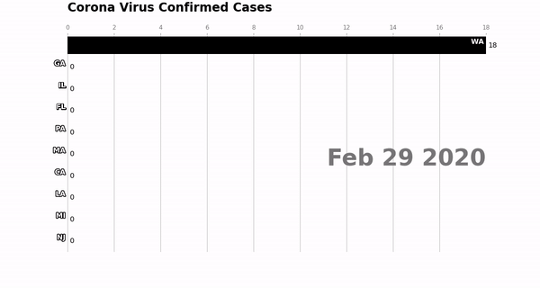

# DataVizFinalProject

Jupyter notebook using pandas and matpoltlib to produce the animated bar chart race shown below.  

Thanks and credit to  [this tutorial](https://towardsdatascience.com/bar-chart-race-in-python-with-matplotlib-8e687a5c8a41) for the starting code and ideas. 